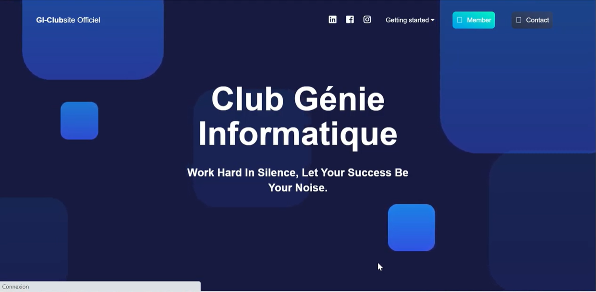
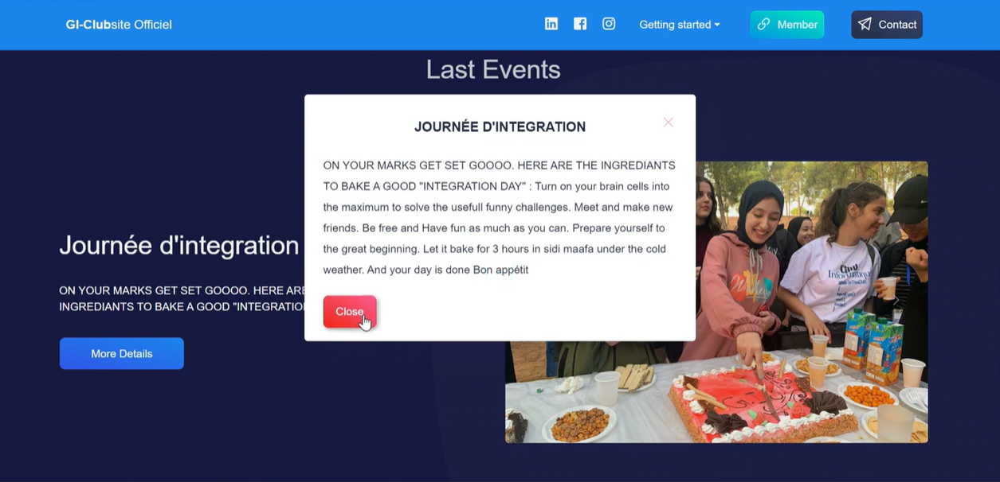
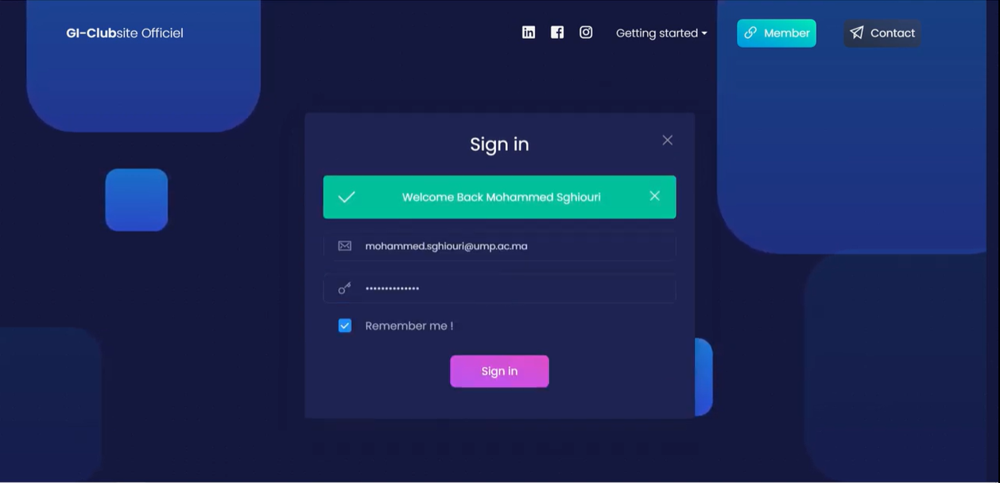
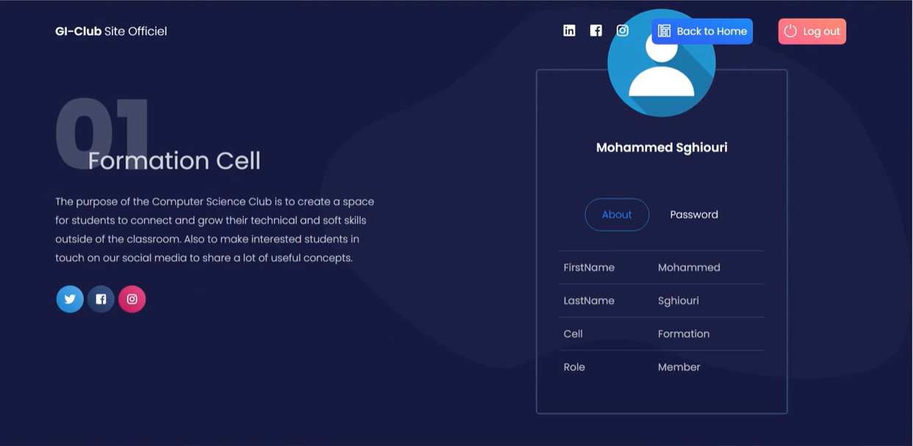
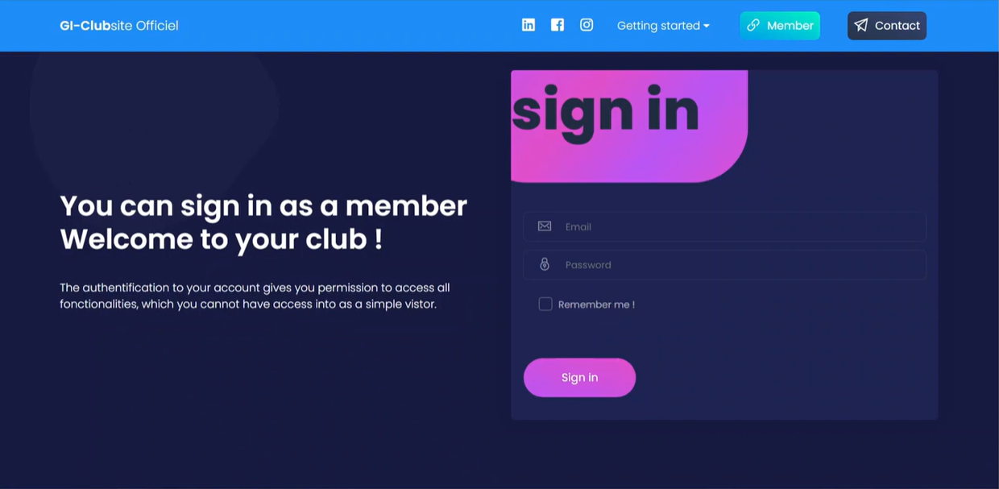
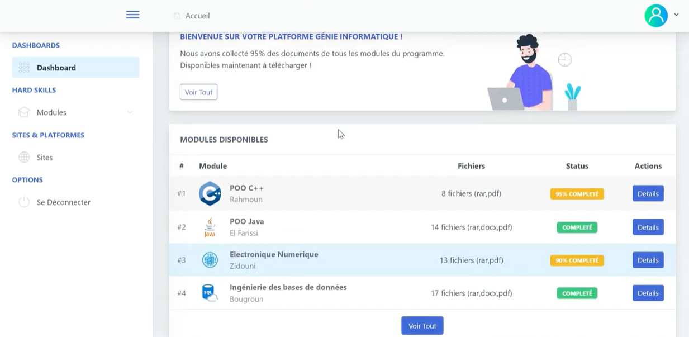

## GiClubSite : Connecting Minds, Empowering Innovators: Explore the World of Computer Engineering with Us!!
<!-- PROJECT LOGO -->
 

  

  <h3 align="center"> ⭐️ GiClubSite ⭐️ </h3>

  

     Le site officiel du Club Génie Informatique est développé dans le but de créer une centralisation
    d'informations et d'offrir un espace dynamique pour notre communauté. 
    Ce site permet de publier facilement les événements et les activités passionnantes du club, 
    de tenir nos membres informés des événements à venir, et de mettre à disposition des cours et les ressources en ligne pertinents. 
    En favorisant la communication et l'accessibilité à ces ressources, notre objectif est de renforcer l'engagement des membres, 
    de promouvoir le partage des connaissances, et de créer une expérience en ligne enrichissante pour tous les passionnés de génie informatique qui nous rejoignent.
     
     
    <a target="_blank" href="https://drive.google.com/drive/folders/1jomhqLlqdc1y3ttj-YqIlxQSZR5Zp8XZ?usp=share_link">
      <strong> 🔗 🔗 Consulter la VIDEO demo sur DRIVE 🔗 🔗</strong>
    </a>
     
     

  

  
  ### Technologies and Tools

  
  
  
  
  
  
  
  
  
  
   
   
   
  
  ### Overview
  
  

    
  

  

    
  

  

    
  

  

    
  

  

    
  

  

    
  

  

    
  

  

